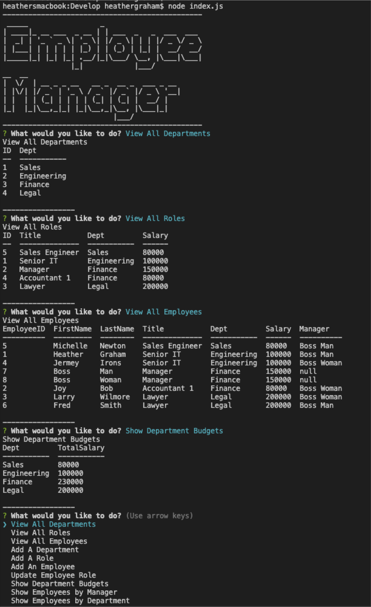

# HOMEWORK #12 - Employee Tracker
The Employee Tracker code can be found here - 

https://github.com/mtnbiker72/employee-tracker

The video that explains how to use the application -

<TBD>

## Required Modules:
* mysql2
* inquirer
* console_table
* dotenv

## Description Summary
This app allows non-developers to view and interact with information stored in an employee database.  It is a command-line interface that manages employee departments, roles, and employees in a company.  

The class functions/sql statements are in the db_utils file.

The schema and seed file are in the db directory.

## Acceptance criteria

 * Command line interface accepts user input 
 * The following options are available:
   - View all departments
   - View all roles
   - View all employees
   - Add a department
   - Add a role
   - Add an employee
   - Update an employee role
   - View employee by manager
   - View employee by department

 * Viewing all departments will show a formatted table showing department name and department ids
 * Viewing all roles will show job title, role id, and the department that the role belongs to, and the salary
 * Viewing all employees will show employee ids, first name, last name, job title, department, salary and managers
 * When you add a department, the name of the department is added to the database
 * When you add a role, the name, salary, the department for the role, and the role is added to the database
 * When you add an employee, the first name, last name, role, the manager of the employee, and the employee are added to the database
 * When you update an employee, you can select the employee and update their role and this information is added to the database
 * View employee list and their managers
 * View employee list by department

## Usage
 - create the database - source schema.sql

 - seed the database - source seed.sql

 - npm i

 - npm start

## Questions, Contact

 * Github:  https://github.com/mtnbiker72

 * Email: heather.graham@yahoo.com

## Images
            